# Wikarta Database ERD

## ERD Utama (Current Schema)

```mermaid
erDiagram
    USERS {
        bigint id PK
        varchar name
        varchar email UK
        timestamp email_verified_at
        varchar password
        text two_factor_secret
        text two_factor_recovery_codes
        timestamp two_factor_confirmed_at
        bigint role_id FK
        varchar phone
        boolean is_active
        timestamp remember_token
        timestamp deleted_at
        timestamp created_at
        timestamp updated_at
    }

    PASSWORD_RESET_TOKENS {
        varchar email PK
        text token
        timestamp created_at
    }

    SESSIONS {
        varchar id PK
        bigint user_id
        varchar ip_address
        text user_agent
        longtext payload
        integer last_activity
    }

    CACHE {
        varchar key PK
        mediumtext value
        integer expiration
    }

    CACHE_LOCKS {
        varchar key PK
        varchar owner
        integer expiration
    }

    JOBS {
        bigint id PK
        varchar queue
        longtext payload
        tinyint attempts
        integer reserved_at
        integer available_at
        integer created_at
    }

    JOB_BATCHES {
        varchar id PK
        varchar name
        integer total_jobs
        integer pending_jobs
        integer failed_jobs
        longtext failed_job_ids
        mediumtext options
        integer cancelled_at
        integer created_at
        integer finished_at
    }

    FAILED_JOBS {
        bigint id PK
        varchar uuid UK
        text connection
        text queue
        longtext payload
        longtext exception
        timestamp failed_at
    }

    ROLES {
        bigint id PK
        varchar name
        varchar slug UK
        text description
        timestamp created_at
        timestamp updated_at
    }

    PERMISSIONS {
        bigint id PK
        varchar name
        varchar slug UK
        varchar module
        text description
        timestamp created_at
        timestamp updated_at
    }

    ROLE_PERMISSIONS {
        bigint role_id PK,FK
        bigint permission_id PK,FK
    }

    PROVINCES {
        bigint id PK
        varchar name
        varchar code UK
        timestamp created_at
        timestamp updated_at
    }

    CITIES {
        bigint id PK
        bigint province_id FK
        varchar name
        enum type "kota|kabupaten"
        varchar code UK
        timestamp created_at
        timestamp updated_at
    }

    DISTRICTS {
        bigint id PK
        bigint city_id FK
        varchar name
        varchar code UK
        timestamp created_at
        timestamp updated_at
    }

    VILLAGES {
        bigint id PK
        bigint district_id FK
        varchar name
        enum type "kelurahan|desa"
        varchar postal_code
        varchar code UK
        timestamp created_at
        timestamp updated_at
    }

    OLTS {
        bigint id PK
        varchar name
        varchar code UK
        varchar brand
        varchar model
        varchar ip_address
        bigint parent_olt_id FK
        bigint city_id FK
        bigint district_id FK
        bigint village_id FK
        decimal latitude
        decimal longitude
        text location_description
        integer total_ports
        integer used_ports
        enum status "active|inactive|maintenance|decommissioned"
        text notes
        varchar photo_path
        bigint created_by FK
        bigint updated_by FK
        timestamp deleted_at
        timestamp created_at
        timestamp updated_at
    }

    ODCS {
        bigint id PK
        bigint olt_id FK
        varchar name
        varchar code UK
        varchar brand
        varchar model
        bigint city_id FK
        bigint district_id FK
        bigint village_id FK
        decimal latitude
        decimal longitude
        text location_description
        text address
        integer total_ports
        integer used_ports
        enum status "active|inactive|maintenance|decommissioned"
        date installation_date
        text notes
        varchar photo_path
        bigint created_by FK
        bigint updated_by FK
        timestamp deleted_at
        timestamp created_at
        timestamp updated_at
    }

    ODPS {
        bigint id PK
        bigint odc_id FK
        bigint olt_id FK
        varchar name
        varchar code UK
        varchar brand
        varchar model
        bigint city_id FK
        bigint district_id FK
        bigint village_id FK
        decimal latitude
        decimal longitude
        text location_description
        text address
        integer total_ports
        integer used_ports
        enum status "active|inactive|full|maintenance|damaged|decommissioned"
        date installation_date
        date last_maintenance_date
        varchar pole_number
        text notes
        varchar photo_path
        bigint created_by FK
        bigint updated_by FK
        timestamp deleted_at
        timestamp created_at
        timestamp updated_at
    }

    ONTS {
        bigint id PK
        bigint odp_id FK
        varchar name
        varchar code UK
        varchar serial_number UK
        varchar customer_name
        decimal latitude
        decimal longitude
        enum status "active|inactive|maintenance|decommissioned"
        date installed_at
        text notes
        bigint created_by FK
        bigint updated_by FK
        timestamp deleted_at
        timestamp created_at
        timestamp updated_at
    }

    MAINTENANCE_LOGS {
        bigint id PK
        varchar loggable_type
        bigint loggable_id
        enum type "routine|corrective|emergency|upgrade"
        bigint performed_by FK
        text description
        text findings
        text resolution
        timestamp performed_at
        timestamp next_maintenance_at
        json photo_paths
        timestamp created_at
        timestamp updated_at
    }

    ACTIVITY_LOGS {
        bigint id PK
        bigint user_id FK
        varchar subject_type
        bigint subject_id
        varchar event
        json old_values
        json new_values
        varchar ip_address
        text user_agent
        timestamp created_at
    }

    ROLES ||--o{ USERS : role_id

    ROLES ||--o{ ROLE_PERMISSIONS : role_id
    PERMISSIONS ||--o{ ROLE_PERMISSIONS : permission_id

    PROVINCES ||--o{ CITIES : province_id
    CITIES ||--o{ DISTRICTS : city_id
    DISTRICTS ||--o{ VILLAGES : district_id

    OLTS ||--o{ OLTS : parent_olt_id

    CITIES ||--o{ OLTS : city_id
    DISTRICTS ||--o{ OLTS : district_id
    VILLAGES ||--o{ OLTS : village_id

    OLTS ||--o{ ODCS : olt_id
    CITIES ||--o{ ODCS : city_id
    DISTRICTS ||--o{ ODCS : district_id
    VILLAGES ||--o{ ODCS : village_id

    ODCS ||--o{ ODPS : odc_id
    OLTS ||--o{ ODPS : olt_id
    CITIES ||--o{ ODPS : city_id
    DISTRICTS ||--o{ ODPS : district_id
    VILLAGES ||--o{ ODPS : village_id

    ODPS ||--o{ ONTS : odp_id

    USERS ||--o{ OLTS : created_by
    USERS ||--o{ OLTS : updated_by
    USERS ||--o{ ODCS : created_by
    USERS ||--o{ ODCS : updated_by
    USERS ||--o{ ODPS : created_by
    USERS ||--o{ ODPS : updated_by
    USERS ||--o{ ONTS : created_by
    USERS ||--o{ ONTS : updated_by

    USERS ||--o{ MAINTENANCE_LOGS : performed_by
    USERS ||--o{ ACTIVITY_LOGS : user_id
```



## Relasi Polymorphic

```text
maintenance_logs.loggable_type + maintenance_logs.loggable_id
-> morph target: olts | odcs | odps | onts (berdasarkan model)

activity_logs.subject_type + activity_logs.subject_id
-> subject generik (bukan FK langsung)
```

## Catatan Status Migrasi

```text
fiber_routes pernah ada (2026_03_13_000012),
tapi di-drop oleh migrasi 2026_04_16_000015_refactor_fiber_routes_to_device_connections.
Schema aktif saat ini tidak lagi menyertakan tabel fiber_routes.
```

## Deployment ke cPanel via GitHub Actions

### Secrets yang wajib
- FTP_HOST
- FTP_PORT
- FTP_USER
- FTP_PASS
- FTP_TARGET_DIR

### Target deploy
Workflow akan mirror upload hasil build ke `FTP_TARGET_DIR` (contoh: `public_html`).

### Trigger deploy
Push tag dengan format `v*`, contoh:

```bash
git tag v1.0.0
git push origin v1.0.0
```

### Catatan migrasi
Deploy FTP tidak mengeksekusi artisan command otomatis.
Jika ada perubahan schema, jalankan manual via cPanel Terminal:

```bash
php artisan migrate --force
php artisan optimize:clear
php artisan config:cache
```

### Rollback cepat
Rollback dilakukan dengan redeploy tag stabil sebelumnya (jalankan ulang workflow untuk tag release lama).
